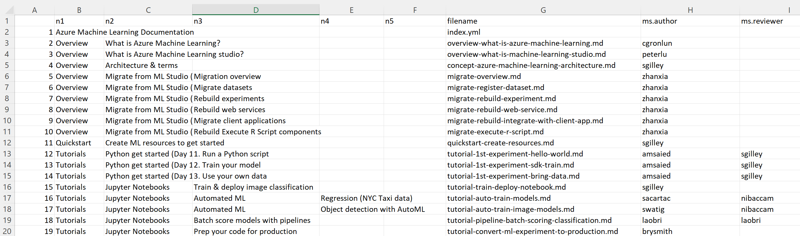

# toc-to-csv 

For repositories on https://github.com/MicrosoftDocs.  Turn your **toc.yml** file into a .CSV file for further work in Excel. Also add metadata from the files, currently `ms.author`, `ms.reviewer`, and `ms.custom`.

## Create-CSV.R script

Change  `myrepo` to point to the local directory that contains the **toc.yml** file you wish to inventory.  Also change the filename if you wish.

The resulting .csv file will look like this: 



In the spreadsheet, each level of the TOC hierarchy is shown in a column named n*.  This lets you sort without losing context. Sort back to the original order from the first column.

### Requirements for the toc.yml file

The **toc.yml** file must contain these entries:
* `name` 
* `href`
* `items`

Optionally, the following entries may exist.  They will be ignored, and not present in the spreadsheet.
* `displayName` (optional)
* `expanded` (optional)

If your yaml file contains anything other than the above, the code as is would not work.  New handling of these entries, in `expandItems` (see below) would first be needed. 

## Subsets.R

This script shows some examples of subsetting the initial data.frame by searching through metadata.

## Current limitations

* The script is not set up to handle includes in the TOC.
* Metadata will be added only for files in the same directory as the TOC.  *Files in sub-directories will not be read.* Use the function again with the sub-directory as input to get those contents.
* The current version may not work well with 1000s of entries.  I've been using it for a directory with a little over 250 files, which takes around 6-7 seconds to complete.

## Installation

### New to R? Installation instructions (for Windows)

[Skip to next section](#for-r-users) if you're already using R.

1. [Download and install R](https://cran.r-project.org/)
   * During install, copy the path where R will be installed
   * When install is complete, edit your PATH system variable and add what you just copied, appending "\bin" to the end.  For example, "C:\Program Files\R\R-4.1.2\bin" if your installation directory is C:\Program Files\R\R-4.1.2""
  
1. Clone this repo 
  
   ```
   git clone https://github.com/sdgilley/toc-to-csv.git --depth -1
   ```
1. Open a windows terminal as *Admin*
1. `cd` to the cloned repo
1. Run the `installs.R` program (You only need to do this once). 
  
    ```
    rscript.exe installs.r
    ```
    
1. Edit the file `Create-CSV.R` in any text editor
1. Change the path to your toc file at the top.
1. Change the name of the file to be written if you wish.  It defaults to **all-docs.csv**.
1. Save the file.
1. In the terminal window, run the script:
  
    ```
    rscript.exe Create-CSV-File.R
    ```
    
 1. The file will be created in your current directory.

### For R users 

If you already have R installed, here's the steps to use the script in your IDE.

1. Clone this repo 
  
   ```
   git clone https://github.com/sdgilley/toc-to-csv.git --depth -1
   ```
1. Open it in your R IDE, such as RStudio
1. Open the file `installs.R` and run it to install packages
1. Open the file `Create-CSV.R`

1. Change the path to your toc file in `myrepo`
1. Change the name of the file to be written if you wish
1. Run the entire file
1. The csv file will be created in your current directory.


## If you want to know more

The main script is **Create-CSV.R**.  This is where you specify the path to your TOC file, and can change the name of the .csv file that is produced.

The heavy work occurs in the function `createMerged`, which reads in the yml file and creates a data.table.  The initial version of the data is an object contains three columns: `name`, `href`, and `items`.  

The function `expandItems` is used to expand an `items` list and merge in columns for the next level of the hierarchy.  This continues until there are no more levels to expand.

Finally, the function `getMetadata` is used to obtain metadata for each file in the directory.  This is then merged with the data from the toc.

Some cleanup is performed and the merged file is returned.  **Create-CSV.R** then writes this merged object as a *csv* file.

## Functions

The script uses three functions. Each function is in its own file.  The functions are:

* `createMerged(myrepo)` - `myrepo` is a path to the repo containing your files. 
  * reads the **toc.yml** file in the myrepo path into an object
  * calls `expandItems` to form the set of columns to describe each file.
  * calls `getMetadata` to add metadata
  * returns the final data.frame containing columns for each level of the TOC, filename, and metadata,
 
* `expandItems(dt)` - `dt` is a data.table that contains a list column, named `items`. This function:
  * expands the list into new columns
  * deletes all columns except for the ones corresponding to name, href, and items
  * merges these columns back to the data.table
  * returns the data.table

* `getMetadata(path)` - `path` is the path to the directory that contains your TOC.  This function:
  * loops through the .md files in the input directory. (It does not traverse subdirectories.)
  * extracts metadata from each file (currently, `ms.author`, `ms.reviewer`, `ms.custom`.  It would be simple to modify this to add others if you wish)
  * returns a data.table that contains each filename and its metadata.  


